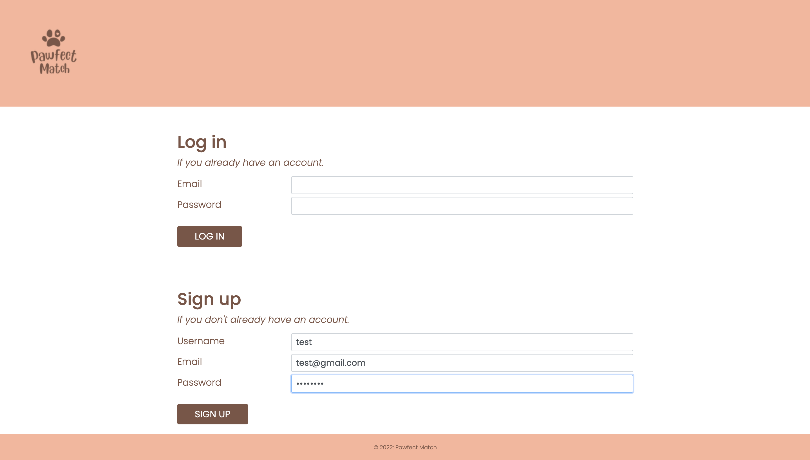

# Pawfect Match

## Table of Contents

* [Description](#description)
* [Access](#access)
* [Installation](#installation)
* [Usage](#usage)
* [Credits](#credits)

## Description

Our goal for this collaborative project was to build a real-world full-stack application from scratch.

### Concept

Our group created Pawfect Match, an application where a user can post their pet for adoption. Other users can then message the owner to meet and potentially adopt the pet if it is their "perfect match".

Our motivation for creating this application was to:
- Help give adoptive pets a second chance, thereby saving lives by reducing the number of animals living (and being euthanised) in shelters
- Help people access the psychological, emotional and physical benefits of having a pet that matches them perfectly
- And, help people save money on the upfront costs of getting a pet (eg. adopted pets are already vaccinated, microchipped).

### User Story

```
AS A pet owner whose circumstances have changed
I WANT a platform where I can post an ad for my pet
SO THAT I can choose a good person to adopt my pet.
```

Currently, Pawfect Match achieves this by allowing its users to post pets and interact via public comments on the post. Possible features that could be implemented in the future to improve the application include:
- Private messaging between current and potential owners
- Making appointments to meet through the application
- And, suggested profile matching for pets needing adoption and people wanting to adopt.

### Tools and Technologies Used

To create Pawfect Match, our group used:
- HTML
- CSS
- Bootstrap
- Javascript
- Node.js 
- Express.js
- Express-handlebars
- MySQL2
- Sequelize
- Dotenv
- Bcrypt
- Express-session
- Connect-session-sequelize
- Nodemailer
- And, Heroku.

### Screenshots of Application




## Access

### Code Repository

The repository where the code is saved is on Github. To access it, click [here](https://github.com/hayleyarodgers/pawfect-match).

### Live Application

Our application is deployed on Heroku. To access it, click [here](https://pawfect---match.herokuapp.com/).

## Installation

To install necessary dependencies, run the following command:

```
npm i
```

## Usage

To use the application from the command line:
1. Open the repository in your terminal or bash.
2. Add a .env file in the same format as [this file](.env.EXAMPLE).
3. Log into MySQL in the command line by entering ```mysql -u root -p``` and the password in your .env file.
4. Create the database by entering ```SOURCE ./db/schema.sql;```.
5. Quit MySQL by entering ```quit```.
6. (Optional) Seed the database with sample data by entering ```npm run seed``` in the command line.
7. Start the server by entering ```npm start``` in the command line.

Alternatively, to use the live application, click [here](https://pawfect---match.herokuapp.com/).

## Credits

- We used [Bootstrap](https://getbootstrap.com/docs/4.5/getting-started/introduction/) for most of our CSS styling.
- We used the [express-handlebars](https://www.npmjs.com/package/express-handlebars) package to use Handlebars.js as our templating engine.
- We used the [MySQL2](https://www.npmjs.com/package/mysql2) and [Sequelize](https://www.npmjs.com/package/sequelize) packages to connect to our MySQL database and perform queries.
- We used the [dotenv](https://www.npmjs.com/package/dotenv) package to use environment variables to store sensitive data needed to run the application.
- We used the [bcrypt](https://www.npmjs.com/package/bcrypt) package to hash passwords.
- We used the [express-session](https://www.npmjs.com/package/express-session) and [connect-session-sequelize](https://www.npmjs.com/package/sequelize) packages to add authentication.
- We used the [nodemailer](https://www.npmjs.com/package/nodemailer) package to send email notifications.
